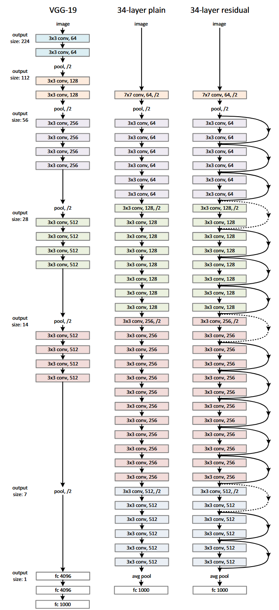
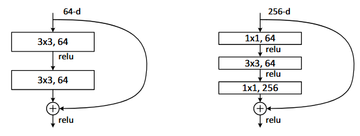
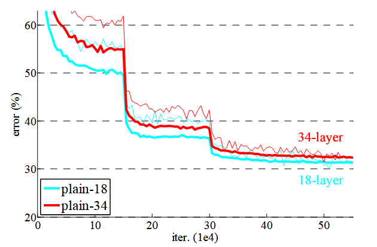
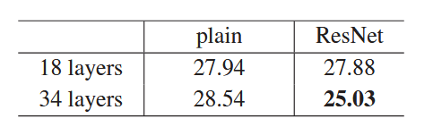
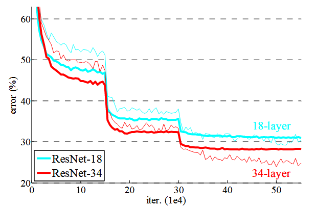
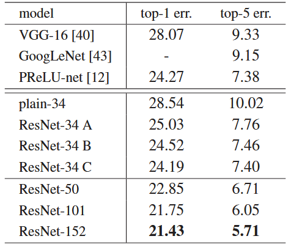
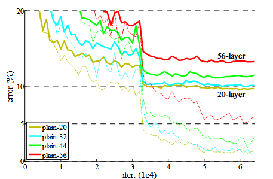
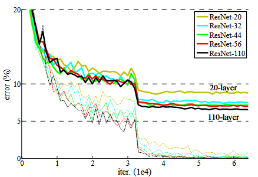
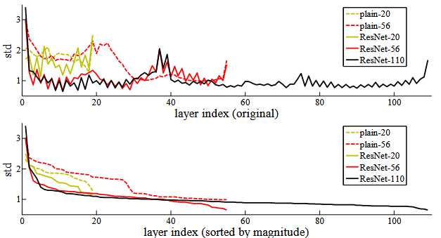

```{=html}
<div class="paper-meta">
  <div class="paper-info">
    <span class="paper-venue">📍 CVPR 2016</span>
    <span class="paper-authors">👥 He, Zhang, Ren, Sun</span>
    <a href="https://arxiv.org/abs/1512.03385" target="_blank" class="paper-link">📄 arXiv</a>
  </div>
  <div class="paper-tags">
    <span class="tag">resnet</span>
    <span class="tag">cnn</span>
    <span class="tag">imagenet</span>
    <span class="tag">deep-learning</span>
    <span class="tag">optimization</span>
  </div>
</div>
```

# 一句话总结

残差学习通过让网络显式地去拟合“输出减输入”的残差函数，而不是直接拟合目标映射，使得 100 层以上的极深网络在优化上变得可训练，并在 ImageNet 等数据集上取得了远超以往的性能。

# Abstract

论文一开始指出一个在深度学习实践中已经反复出现但尚未被系统解释的事实：随着网络深度的增加，神经网络在优化层面变得更加困难。这里强调的是“训练困难”，而不是模型容量不足或泛化能力不足。

作者提出了一种残差学习（residual learning）框架，其核心思想并不是改变网络所能表示的函数族，而是通过重新参数化的方式，使得极深网络在优化意义上更加容易训练。具体而言，论文不再直接让若干层去拟合一个“无参照”的映射，而是让它们去拟合相对于输入的残差函数。

在 ImageNet 数据集上，作者成功训练了深度达到 152 层的网络，该深度约为 VGG 网络的 8 倍，但在计算复杂度上反而更低。这一事实本身已经构成对“深度不可训练”这一经验认知的直接反驳。

论文进一步给出了在 ImageNet 测试集上达到 3.57% top-5 error 的集成结果，并在 CIFAR-10 数据集上系统性地分析了 100 层乃至 1000 层网络的行为。这表明，残差学习并非某个特定数据集或任务的技巧，而是一种具有普适性的优化思想。

# 1 Introduction

## 1.1 深度在视觉表征中的角色

深度卷积神经网络已经在图像分类等视觉任务中取得了一系列突破性进展。深层网络能够在端到端的框架中同时完成特征抽取与分类决策，并且随着网络深度的增加，模型能够形成从低层到高层逐级抽象的多层次表征。

大量已有工作（如 VGG、GoogLeNet 等）已经表明，网络深度对于 ImageNet 这类大规模视觉任务具有决定性影响。这些先进模型的核心共同点在于“非常深”的结构设计，因此增加网络深度本身并不是一个有争议的方向。

## 1.2 传统困难已被缓解，但新问题浮现

在早期深度神经网络研究中，训练困难通常被归因于梯度消失或梯度爆炸问题。该问题在理论与实践上都已得到较为充分的研究，并且随着合适的参数初始化方法以及 Batch Normalization 的引入，具有数十层的网络已经可以稳定地通过随机梯度下降进行训练。[1 Batch Normalization（BN）](#batch-normalizationbn)

然而，作者指出，即便在这些技术已经有效缓解梯度问题的前提下，随着网络深度继续增加，一种新的现象开始出现，即所谓的“退化问题（degradation problem）”。

## 1.3 Degradation Problem 的定义与现象

退化问题指的是这样一种反直觉的现象：当网络深度增加到一定程度后，模型在训练集上的性能不仅不再提升，反而明显变差。更重要的是，这种性能下降并不是由于过拟合引起的，而是直接体现在训练误差的上升上。

文中给出的 Fig.1 展示了一个典型例子：在 CIFAR-10 数据集上，对比一个 20 层的 plain 网络和一个 56 层的 plain 网络，可以观察到更深的网络在整个训练过程中都保持着更高的训练误差，同时测试误差也相应更高。

这带来了一个重要的理论矛盾。设浅层网络的参数空间为 $\theta_{20}$，深层网络的参数空间为 $\theta_{56}$，显然有 $\theta_{20} \subset \theta_{56}$。从优化理论上看，应当满足 $$
\min_{\theta \in \theta_{56}} L(\theta) \le \min_{\theta \in \theta_{20}} L(\theta),
$$ 但实验结果却与这一基本包含关系相矛盾。

## 1.4 构造性解与优化失败的矛盾

作者进一步提出了一个关键的思想实验。给定一个已经训练完成的浅层网络，可以通过构造的方式得到一个更深的网络：新增的层全部实现恒等映射，其余层参数直接复制自浅层网络。由此构造出的深层网络在函数层面与原网络完全等价，因此其训练误差不可能更高。

这一构造性解的存在表明，深层网络的最优解至少不劣于浅层网络。然而，实际训练过程中，基于现有优化方法的求解器却无法在可行时间内找到这一类解。这说明问题并不在于解的不存在，而在于优化过程本身存在系统性障碍。

正是在这一背景下，作者引出了残差学习的核心思想：通过对网络中每一小段映射进行重新参数化，使得“接近恒等映射”的解在参数空间中更容易被优化算法所到达。

# 2 Related Work

## 2.1 Residual Representations 的历史背景

论文首先指出，“残差表示（residual representations）”并非深度学习中首次出现的概念。在计算机视觉的传统方法中，残差思想早已被广泛使用，其核心动机是：相比直接建模原始信号，对“相对于某个参考的偏差”进行建模往往更加有效。

在图像检索与分类领域，VLAD 表示通过对局部特征相对于视觉词典中心的残差进行编码来构建全局描述子。Fisher Vector 也可以被视为一种概率化的残差编码形式。这些方法的共同特点在于：它们并不直接编码原始特征，而是编码特征与某个基准之间的偏差。

在向量量化问题中，也已有研究表明，对残差向量进行编码比直接编码原始向量更加高效。这些工作说明，从表示学习的角度看，残差形式本身具有更好的结构性质。

作者在这里的用意并不是声称 ResNet 直接继承了这些方法，而是强调：**“残差”作为一种建模思想，在多个领域中已经被反复验证为有利于优化和表示的结构选择**。

## 2.2 数值计算与 PDE 中的残差思想

论文进一步将视角扩展到低层视觉与计算机图形学中的数值计算问题，尤其是偏微分方程（PDE）的求解。

在多重网格（Multigrid）方法中，问题被分解为多个尺度上的子问题，其中每一层负责估计相对于更粗尺度解的残差。通过逐级修正残差，多重网格方法可以显著加速收敛，相比直接在原空间中求解具有更好的数值性质。

类似地，层次基函数预条件（hierarchical basis preconditioning）方法通过显式引入“尺度之间的残差变量”，有效改善了线性系统的条件数。这些方法在理论与实践中都被证明能够比忽略残差结构的标准求解器收敛得更快。

作者在此强调的是一个抽象但重要的观点：**通过合适的重参数化或预条件化（preconditioning），可以显著简化优化问题本身**。这为后文将残差思想引入深度网络提供了跨领域的合理性支持。

## 2.3 捷径链接（Shortcut Connections） 的已有研究

论文接下来回顾了 shortcut connection 在神经网络历史中的多种形式。早期在多层感知机中，就已有从输入到输出直接引入线性连接的做法，其目的是缓解深层网络的训练困难。

在更近期的工作中，一些方法通过将中间层直接连接到辅助分类器，来缓解梯度消失或梯度爆炸问题。这类方法的核心目标仍然是改善反向传播过程中的信号传递。

此外，还有一系列工作通过对激活、梯度或误差进行中心化或线性变换，从而改善优化行为。这些方法在实现层面上往往也依赖于 shortcut connections。

在 Inception 网络中，作者也采用了并行分支结构，其中浅分支在一定程度上起到了 shortcut 的作用。

## 2.4 与 Highway Networks 的对比与区分

论文特别讨论了与 ResNet 同期出现的 Highway Networks。Highway Networks 通过引入带参数的门控函数来控制 shortcut 分支的开启或关闭，从而在理论上允许网络在“残差形式”和“非残差形式”之间自由切换。[2 Highway Network]

作者在这里给出了一个非常关键的区分：Highway Networks 的门控连接在极端情况下可以被关闭，使得网络退化为普通的非残差映射；而 ResNet 中的 identity shortcut 是**始终开启的**，且不包含任何可学习参数。

这意味着，在 ResNet 中，每一个残差块无论如何都会显式学习一个以恒等映射为参考的残差函数，而不是在“是否使用残差”之间进行选择。

此外，作者指出，当时的 Highway Networks 并未在超过百层的极深网络中展示出显著的性能提升，而 ResNet 的目标正是验证残差结构在极深条件下的可扩展性。

## 2.5 Section 2 的方法论意义

通过这一节的回顾，作者完成了一个重要的定位工作：残差学习并不是一个孤立的工程技巧，而是深植于数值优化、信号表示以及神经网络训练历史中的一种通用思想。

这一节为后续 Section 3 中正式提出“Residual Learning Framework”奠定了理论与实践上的合理性基础，也为读者理解 ResNet 的核心创新点提供了必要的背景参照。

# 3 Deep Residual Learning

## 3.1 Residual Learning

作者首先强调一个看似平凡但在理论上并未解决的问题。设 $H(x)$ 表示希望由若干层网络拟合的潜在映射，其中 $x$ 是这些层的输入。作者指出，如果假设多层非线性网络在极限情况下可以逼近任意复杂函数，那么它们同样也可以逼近残差函数 $H(x) - x$，前提是输入与输出具有相同的维度。

在此基础上，论文提出将原本的学习目标从直接拟合 $H(x)$，显式地重写为学习一个残差函数： $$
F(x) := H(x) - x,
$$ 从而将原始映射重新表述为 $$
H(x) = F(x) + x.
$$

作者特别指出，这两种形式在函数逼近能力上是等价的，但在优化层面上，它们的学习难度可能截然不同。论文并未声称残差形式在理论上具有更强的表达能力，而是提出一个假设：在实际优化过程中，残差形式可能更容易被随机梯度下降所优化。

这一假设直接来源于在 Introduction 中展示的 degradation problem。作者回顾了一个关键事实：如果向一个已经训练好的浅层网络中添加若干层，并将这些新增层构造成恒等映射，那么得到的深层网络在训练误差上不应劣于原网络。然而实验表明，现有的优化方法在可行时间内无法找到这样的解。

作者由此推断，问题并不在于解不存在，而在于求解过程本身的困难。残差重参数化的直觉在于：如果最优映射接近恒等映射，那么让网络去学习一个接近零的残差函数，比让网络通过多层非线性变换去“重现输入本身”要容易得多。

作者进一步补充说明，在真实任务中，最优映射不太可能恰好是恒等映射。但即便如此，如果最优映射在某种意义上更接近恒等映射而非零映射，那么以恒等映射作为参考进行学习，仍然可能起到类似预条件（preconditioning）的作用。作者在后文通过实验观察到，学习到的残差函数在幅值上通常较小，这为上述直觉提供了经验支持。

## 3.2 Identity Mapping by Shortcuts

为了在网络结构中实现 $F(x) + x$ 的形式，作者引入了 shortcut connections。论文在这一小节中给出了残差块的正式定义： $$
y = F(x, \{W_i\}) + x.
$$

这里，$x$ 和 $y$ 分别表示该残差单元的输入与输出，$F(x, \{W_i\})$ 表示需要学习的残差映射，$\{W_i\}$ 是其参数集合。作者以一个包含两层的示例说明，当采用 ReLU 激活函数并省略偏置项时，可以将 $F$ 写成： $$
F(x) = W_2 \sigma(W_1 x),
$$ 其中 $\sigma(\cdot)$ 表示 ReLU 非线性。

在结构实现上，$F(x)$ 与 $x$ 的相加通过 shortcut connection 完成，该操作是逐元素相加。论文明确指出，在相加之后再施加非线性激活函数，即 $y$ 之后接 ReLU，这是其采用的标准做法。

作者反复强调，恒等 shortcut 不引入任何额外参数，也不增加计算复杂度。这一点在实验对比中尤为重要，因为它保证了 residual network 与对应的 plain network 在参数量、深度、宽度以及计算代价上的可比性。

论文进一步讨论了输入与输出维度不一致的情况。例如，当通道数发生变化时，$x$ 与 $F(x)$ 无法直接相加。此时作者提出使用线性投影来匹配维度： $$
y = F(x, \{W_i\}) + W_s x,
$$ 其中 $W_s$ 通常由 $1 \times 1$ 卷积实现。

作者指出，在理论上也可以在维度一致时使用投影 shortcut，但实验结果表明，恒等映射已经足以解决 degradation problem，并且更加经济。因此，在论文的主要实验中，$W_s$ 仅在维度不匹配时使用。

作者还明确指出，如果 $F(x)$ 仅包含一层线性变换，则残差结构退化为： $$
y = W_1 x + x,
$$ 这种形式并未在实验中表现出明显优势。这说明残差学习的有效性并非来自简单的线性叠加，而是来自多层非线性变换在残差形式下的优化特性。

## 3.3 Network Architectures：Plain Network 与 Residual Network 的对应设计

在正式进入大规模实验之前，作者首先说明用于 ImageNet 实验的网络结构设计原则。这里的一个核心目标是：在对比 plain network 与 residual network 时，尽可能排除“参数量”和“计算量”差异带来的干扰。

作者指出，其 plain network 的设计主要受到 VGG 网络的启发，但并非简单复刻。所有卷积层几乎全部采用 $3 \times 3$ 卷积核，并遵循两个明确的设计规则。

第一，在输出特征图尺寸相同的阶段内，各卷积层使用相同数量的通道数。第二，当特征图的空间尺寸减半时，通道数相应翻倍，以保持单层的时间复杂度大致不变。

下采样并未通过池化层完成，而是直接通过 stride 为 2 的卷积层实现。网络末端采用全局平均池化（global average pooling），并接一个 1000 维全连接层用于 ImageNet 分类。

在下图中，作者给出了一个包含 34 个加权层的 plain network 结构。该模型的计算复杂度约为 $3.6 \times 10^9$ FLOPs，仅为 VGG-19 的约 18%。这一点十分关键，因为它确保后续实验中的性能差异并非来自“更大的模型容量”。

在 residual network 中，作者并未重新设计网络结构，而是直接在上述 plain network 的基础上引入 shortcut connections，从而将其逐块转换为残差结构。也就是说，residual network 与 plain network 在层数、通道数、卷积核尺寸以及整体计算复杂度上保持一致。

当输入与输出维度一致时，shortcut 采用恒等映射；当通道数或特征图尺寸发生变化时，则采用两种策略之一：其一是使用恒等映射并在通道维度上进行零填充；其二是使用 $1 \times 1$ 卷积进行线性投影以匹配维度。作者在后续实验中对这两种策略进行了系统比较。

这一节的一个隐含但重要的结论是：残差学习并不是依赖于某种特殊的网络宽度或深度分配，而是可以直接嵌入到标准卷积网络设计中。

{fig-align="center"}

## 3.4 Bottleneck 设计：在极深网络中的必要性

在构建更深的残差网络时，作者面临一个现实问题：如果继续使用由两个 $3 \times 3$ 卷积构成的残差块，网络在深度增加时将迅速变得计算代价高昂。

为此，作者引入了一种“瓶颈（bottleneck）”残差块结构。该结构不再由两层卷积组成，而是采用三层卷积的形式： $$
1 \times 1 \;\rightarrow\; 3 \times 3 \;\rightarrow\; 1 \times 1.
$$

其中，第一个 $1 \times 1$ 卷积用于降低通道维度，$3 \times 3$ 卷积在低维空间中进行计算，最后一个 $1 \times 1$ 卷积再将通道维度恢复到原始规模。这一设计使得残差函数 $F(x)$ 在保持表达能力的同时，大幅降低了计算量。

作者在下图中对比了标准残差块与 bottleneck 残差块，并指出二者在时间复杂度上是相近的，但 bottleneck 结构在参数效率上更加适合构建 50 层、101 层乃至 152 层的网络。

在这一部分中，作者特别强调了恒等 shortcut 在 bottleneck 结构中的重要性。如果在 bottleneck 结构中对 shortcut 分支也使用投影操作，那么 shortcut 将直接连接到高维特征空间，从而导致参数量和计算量显著增加。相反，恒等 shortcut 能够在不引入额外开销的情况下维持残差学习框架。

基于 bottleneck 设计，作者构建了 50 层、101 层和 152 层的残差网络。尽管网络深度显著增加，152 层 ResNet 的计算复杂度仍然低于 VGG-16 和 VGG-19，这一点进一步说明了 bottleneck 结构在实践中的合理性。

作者还补充说明，使用非 bottleneck 的残差块同样可以从深度增加中获得性能提升，这一点在 CIFAR-10 实验中得到了验证。但在 ImageNet 这类大规模任务中，bottleneck 设计在计算效率和训练可行性方面具有明显优势，因此被作为主要结构采用。

{fig-align="center"}

# 4 Experiments

## 4.1 ImageNet Classification

### 4.1.1 论断一：Plain 网络在加深后出现 optimization degradation

作者在前文提出的核心论断之一是：即使在不存在梯度消失或梯度爆炸的情况下，随着网络深度的增加，plain network 在优化层面仍然会出现显著困难，其直接表现为训练误差的上升。

为了验证这一点，作者首先构建了两个 plain 网络，分别为 18 层与 34 层。这两个网络在结构设计上遵循相同的原则，区别仅在于深度。

### 4.1.2 实验设计：18-layer vs 34-layer plain networks

两种 plain 网络均采用以下统一设置：

输入为 ImageNet 2012 数据集\
使用 $3 \times 3$ 卷积为主的网络结构\
采用 Batch Normalization\
采用相同的初始化方式\
使用相同的 SGD 训练策略

因此，深度是唯一系统性变化的因素。

### 4.1.3 图表解释

{fig-align="center"}

上图展示了 18 层与 34 层 plain 网络在训练过程中的训练误差与验证误差曲线。可以清楚观察到，在整个训练过程中，34 层网络的训练误差始终高于 18 层网络。

这一结果直接否定了“更深网络至少不劣于浅层网络”的经验假设。由于 34 层网络的参数空间包含 18 层网络的参数空间，这种现象无法用过拟合解释。

{fig-align="center"}

上表中的验证集 top-1 error 进一步印证了这一点。34 层 plain 网络的错误率高于 18 层网络。

### 4.1.4 中间结论

这一实验直接支持了作者提出的 degradation problem：即 plain 深层网络在优化层面无法达到其理论应有的性能下界。

### 4.1.5 论断二：残差学习可以消除 optimization degradation

作者的第二个核心论断是：通过引入 residual learning 框架，深层网络可以避免上述 optimization degradation，并能够从深度增加中持续获益。

### 4.1.6 实验设计：18-layer vs 34-layer ResNet

作者在与 plain 网络完全一致的结构基础上，引入 shortcut connections，将其转换为 residual networks。此时：

网络深度保持不变\
参数量保持不变\
计算复杂度保持不变

唯一变化是网络的参数化方式。

### 4.1.7 图表解释

{fig-align="center"}

上图展示了 18 层与 34 层 ResNet 的训练与验证误差。与 plain 网络的情况形成鲜明对比，34 层 ResNet 在整个训练过程中均保持更低的训练误差，并在验证集上取得显著更好的性能。

仍然是上面表格显示，34 层 ResNet 相比 18 层 ResNet 的 top-1 error 降低了约 2.8%。这一结果表明，在残差学习框架下，网络确实能够从深度增加中获益。

### 4.1.8 关键推论

对比两图可以得出一个非常重要的推论：残差学习并非只是加速收敛，而是实质性地改变了深层网络的可优化性。

### 4.1.9 论断三：BN 已经排除了梯度消失作为解释

作者特别指出，所有 plain 网络均已使用 Batch Normalization。训练过程中，前向信号与反向梯度均保持健康的数值范围。

因此，plain 网络的性能退化并非由于梯度消失或爆炸，而是源于更深层次的优化结构问题。这一观察为残差学习的必要性提供了关键背景。

### 4.1.10 论断四：Identity shortcut 已足够解决问题

作者进一步比较了三种 shortcut 设计：

使用零填充的恒等 shortcut\
仅在维度变化处使用投影 shortcut\
在所有 shortcut 处使用投影

### 4.1.11 实验设计与表格解读

{fig-align="center"}

表格显示，这三种方案均显著优于对应的 plain 网络。使用投影 shortcut 在数值上略优，但差异较小。

作者据此得出结论：identity shortcut 已经足以解决 optimization degradation，投影 shortcut 并非必要条件。

### 4.1.12 论断五：更深的 ResNet 持续获得性能提升

在引入 bottleneck 结构后，作者构建了 50、101 和 152 层 ResNet。

### 4.1.13 实验结果解读

如上表，随着网络深度从 34 层增加至 152 层，top-1 与 top-5 error 持续下降，且未观察到 optimization degradation。

尤其值得注意的是，152 层 ResNet 在计算复杂度低于 VGG 网络的情况下，取得了显著更优的性能。

## 4.2 CIFAR-10 Experiments

### 4.2.1 论断六：optimization degradation 是普遍现象

作者在 CIFAR-10 数据集上复现实验，验证 optimization degradation 并非 ImageNet 特有。

### 4.2.2 实验设计与结果解读

{fig-align="center"}

如图显示，随着 plain 网络深度增加，训练误差显著上升。

{fig-align="center"}

而上图显示，ResNet 随深度增加训练误差持续下降。

这一结果表明，残差学习在不同数据规模与任务复杂度下均表现出一致的优化优势。

### 4.2.3 残差函数幅值分析[3 残差响应为何随深度减小]

{fig-align="center"}

作者分析了各层残差输出的标准差。如上图显示，ResNet 中残差函数的响应幅值普遍较小，且随网络深度增加而进一步减小。

这一结果从经验角度支持了 Section 3 中的假设：残差学习确实使网络以“接近恒等映射的方式”逐层修正输入。

### 4.2.4 超深网络的探索

作者成功训练了一个包含 1202 层的 ResNet，在训练集上几乎达到零误差。这一实验表明，残差结构在优化层面并不存在深度上的硬性上限。

尽管该模型在测试集上的表现不如较浅的 ResNet，作者将其归因于过拟合，而非优化失败。

## 4.3 Detection Experiments 的补充论证

作者在目标检测任务中用 ResNet 替换 VGG 网络作为特征提取器，并在 PASCAL VOC 与 COCO 数据集上获得显著提升。

由于检测框架保持不变，性能提升只能归因于更深、更易优化的残差表示。

## 4.4 Section 4 的整体结论

Section 4 通过系统性的实验，逐条验证了 Section 3 中提出的所有核心论断。实验结果表明，残差学习通过改变网络的参数化方式，从根本上缓解了深层网络的优化困难，并使极深网络在实际任务中成为可能。

# 补充

## 1 Batch Normalization（BN） {#batch-normalizationbn}

### 1.1 提出背景与核心问题

Batch Normalization 最早由 Ioffe 与 Szegedy 在 ICML 2015 提出，其直接动机是解决深度神经网络训练过程中出现的不稳定与收敛缓慢问题。随着网络层数的增加，参数更新会导致中间层输入分布不断发生变化，从而使得每一层在训练过程中都需要不断适应新的输入分布，这一现象在原论文中被称为 *Internal Covariate Shift*。

无论是否接受这一术语的严格定义，BN 的提出都基于一个经验事实：在深层网络中，若不对中间层的激活分布进行约束，随机梯度下降在数值层面会变得极其不稳定，对学习率和初始化高度敏感。

### 1.2 Batch Normalization 的数学定义

设某一层在一个 mini-batch 上的输入为 $$
\{x_1, x_2, \dots, x_m\},
$$ 其中 $m$ 为 batch size。BN 对该 batch 进行如下变换。

首先计算 batch 均值： $$
\mu_B = \frac{1}{m} \sum_{i=1}^{m} x_i.
$$

然后计算 batch 方差： $$
\sigma_B^2 = \frac{1}{m} \sum_{i=1}^{m} (x_i - \mu_B)^2.
$$

对输入进行标准化： $$
\hat{x}_i = \frac{x_i - \mu_B}{\sqrt{\sigma_B^2 + \epsilon}},
$$ 其中 $\epsilon$ 是一个用于数值稳定性的常数。

最后引入可学习的仿射变换参数： $$
y_i = \gamma \hat{x}_i + \beta,
$$ 其中 $\gamma$ 与 $\beta$ 通过反向传播学习得到。

这一步非常关键，它保证了 BN 并不限制网络的表示能力。若网络在某一层上确实需要特定的均值与尺度分布，则可以通过学习到的 $\gamma, \beta$ 自动恢复。

### 1.3 在卷积神经网络中的 BN 形式

在卷积神经网络中，BN 通常按通道（channel）进行。设某一通道的特征图为 $$
x \in \mathbb{R}^{m \times H \times W},
$$ 则均值与方差在 $m \times H \times W$ 维度上统计，而 $\gamma, \beta$ 对应每一个通道。

因此，卷积层后的 BN 实质上是在约束每个通道的激活分布，而非单个神经元。

### 1.4 BN 对反向传播的影响（优化视角）

从优化角度看，BN 的核心作用并不在于“改变目标函数”，而在于**重参数化了优化问题**。

考虑一层线性变换： $$
z = Wx,
$$ 若 $x$ 的尺度发生变化，则同样的参数更新幅度会导致 $z$ 的尺度发生剧烈变化，从而使得梯度在层间传播时出现不稳定。

BN 通过强制约束 $\hat{x}$ 的一阶与二阶统计量，使得每一层的输入在训练过程中始终处于一个相对稳定的数值区间内，从而显著改善了损失函数在参数空间中的条件数。

这使得随机梯度下降在更大的学习率范围内仍然保持稳定收敛。

### 1.5 BN 与初始化、学习率的关系

在没有 BN 的情况下，网络训练对参数初始化极其敏感，初始化的尺度往往需要与激活函数形式严格匹配，例如 ReLU 网络中常用的 He initialization。

引入 BN 后，这种敏感性被大幅削弱。即便初始化尺度略有偏差，BN 也会在前向传播阶段对激活进行标准化，从而避免信号在深层网络中指数级放大或衰减。

这也是 BN 能够允许更大学习率的重要原因之一。

### 1.6 BN 并不能解决的问题：与 ResNet 的关系

一个极其重要但容易被误解的事实是：Batch Normalization 并不能从根本上解决“深度越深越难训练”的问题。

在 ResNet 论文中，所有 plain 网络均已使用 BN，但随着网络深度增加，训练误差仍然显著上升，出现所谓的 degradation problem。这说明，即便前向激活与反向梯度在数值上保持稳定，优化算法仍然可能难以在高维参数空间中找到接近恒等映射的解。

因此，BN 的作用可以总结为：\
它解决的是“网络是否能稳定训练”的问题，\
而 ResNet 解决的是“网络是否能随着深度增加而持续优化”的问题。

### 1.7 BN 的推理阶段（Inference）处理

在测试阶段，由于无法再依赖 mini-batch 统计量，BN 使用训练阶段累计的全局均值与方差进行归一化。具体而言，使用训练过程中估计得到的 $$
\mu = \mathbb{E}[\mu_B], \quad \sigma^2 = \mathbb{E}[\sigma_B^2].
$$

此时 BN 退化为一个固定的仿射变换，不再引入随机性。

### 1.8 总结性理解

从现代优化视角看，Batch Normalization 本质上是一种通过标准化中间表示来改善优化几何结构的技术。它使得深度网络在数值层面“可训练”，但并不保证深度本身一定带来性能提升。

正是在 BN 已经解决数值稳定问题的前提下，ResNet 才得以揭示一个更深层次的问题：即便梯度不消失，深层 plain 网络在逼近恒等映射时仍然存在结构性优化困难。

## 2 Highway Network

Highway Network 是在 ResNet 之前提出的一类用于训练深层神经网络的结构，其核心思想是通过引入“可学习的门控机制”，在网络中显式控制信息是“被变换”还是“被直接传递”。

在 Highway Network 中，一个典型的层被定义为： $$
y = T(x) \cdot F(x) + (1 - T(x)) \cdot x
$$ 其中，$x$ 是输入，$F(x)$ 表示非线性变换分支，$T(x)$ 是一个取值在 $(0,1)$ 之间的门控函数，通常由一个 sigmoid 函数实现，并且包含可学习参数。

从结构上看，Highway Network 同时包含两条路径：一条是对输入进行非线性变换的路径 $F(x)$，另一条是直接传递输入的路径 $x$。门控函数 $T(x)$ 决定了在当前层中，这两条路径各自所占的比例。

当 $T(x) \approx 1$ 时，输出主要由非线性变换 $F(x)$ 决定，该层更接近普通的深层网络；当 $T(x) \approx 0$ 时，输出主要由恒等映射 $x$ 决定，该层接近于“跳过变换”。

这种设计的初衷是：允许网络在训练过程中自动选择是否需要对输入进行复杂变换，从而缓解深层网络中的优化困难。

然而，这种灵活性也带来了一个重要特性：Highway Network 并不强制每一层都以“残差形式”进行学习。由于门控函数可以被关闭，网络在某些层上可能退化为普通的非残差映射。

相比之下，ResNet 采用的结构更为简洁，其基本形式为： $$
y = F(x) + x
$$ 在该结构中，shortcut connection 始终是开启的，并且不包含任何可学习参数。这意味着 ResNet 强制每一个残差块都学习一个“相对于恒等映射的修正项”，而不是在“是否使用残差”之间进行选择。

因此，从方法论角度看，Highway Network 提供的是一种“可选的残差路径”，而 ResNet 提供的是一种“始终存在的残差参考”。正是这种结构上的强制约束，使得 ResNet 在极深网络（如上百层）中展现出更稳定的优化行为。

## 3 残差响应为何随深度减小

{fig-align="center"}

### 3.1 图像背景与实验设置说明

图像出现在 Section 4.2（CIFAR-10 实验）中，其目的是对 Section 3.1 中提出的一个关键假设进行经验检验：在残差网络中，学习到的残差函数 $F(x)$ 在数值幅度上是否真的“较小”。

作者在该实验中统计的对象并非最终输出，而是每一个残差块内部 $3 \times 3$ 卷积层的响应。更具体地说，统计的是每一层在 Batch Normalization 之后、非线性激活之前的输出。

设第 $l$ 个卷积层的输出为 $z_l$，作者对 $z_l$ 的所有通道与空间位置，在测试集上计算其标准差： $$
\mathrm{std}(z_l).
$$

这一统计量用于衡量该层输出的“响应强度”。

### 3.2 图像的两种排序方式及其意义

图像包含上下两组图，每组图中又对比了 plain network 与 residual network。

-   上方图像按照网络中的层顺序直接绘制，即横轴表示层编号从浅到深。

-   下方图像则将所有层按其响应标准差从大到小排序。

这种双重展示方式非常重要。第一种排序反映“深度演化趋势”，第二种排序用于排除“个别异常层”的影响，从整体分布角度比较不同网络结构。

### 3.3 关键观察一：Residual Network 的响应整体更小

无论采用哪一种排序方式，Residual Network 中各层的响应标准差都显著小于对应深度的 plain network。

这说明，在残差结构下，每一层对输入信号所施加的“修正量”在数值上更温和，而不是剧烈改变输入。

这一现象并非由 BN 直接导致。BN 只保证输出具有稳定的统计尺度，但并不会强制不同网络结构学到相似大小的激活。图像所反映的差异来源于参数化方式本身。

### 3.4 关键观察二：网络越深，残差响应越小

在 ResNet-20、ResNet-56 和 ResNet-110 的对比中，可以观察到一个单调趋势：随着网络深度增加，单个残差块的平均响应幅度反而减小。

这是一条极其反直觉但意义深远的现象。它表明，更深的残差网络并不是通过“每一层做更多事情”来实现复杂映射，而是通过“更多层，每层做更小的修正”来完成整体变换。

### 3.5 与 Section 3.1 假设的直接对应关系

回到 Section 3.1，作者曾提出如下动机性假设：如果最优映射接近恒等映射，那么学习残差 $F(x)$ 会更容易。

图像的实验结果提供了一个重要的经验佐证：训练完成后的残差网络确实收敛到了这样一种状态，即： $$
F_l(x) \approx 0
$$ 对大多数层成立，且随着层数增加，这一近似关系变得更加明显。

这意味着，残差网络在函数层面上更接近于一种“以恒等映射为主、以小幅修正为辅”的表示形式。

### 3.6 优化角度的解释：为何更深反而更“平缓”

从优化角度看，这一现象可以理解为一种自适应的任务分解。当网络层数增加时，整体映射被分解为更多的子步骤。每一个子步骤只需要承担整体变换中的一小部分，因此其对应的残差函数幅度自然减小。

这与数值分析中对常微分方程的时间离散化有高度一致性。将一个连续演化过程拆分为更多时间步，每一步的变化量必然更小，从而提高整体系统的稳定性。

### 3.7 与反向传播稳定性的关系

残差响应幅度减小还直接影响反向传播的性质。对于一个残差块： $$
y = x + F(x),
$$ 其局部 Jacobian 为： $$
\frac{\partial y}{\partial x} = I + \frac{\partial F(x)}{\partial x}.
$$

当 $F(x)$ 本身幅度较小时，其导数项 $\frac{\partial F(x)}{\partial x}$ 通常也较小，使得 Jacobian 更接近于单位矩阵。这意味着梯度在层间传播时不会发生系统性的放大或衰减。

因此，图像不仅验证了残差函数“数值较小”，也间接解释了为何深层 ResNet 在反向传播中保持稳定。

### 3.7 与 plain network 的本质差异

在 plain network 中，每一层都需要承担完整的变换职责，因此其响应幅度不会随着深度增加而自然减小。相反，层数增加反而可能加剧优化难度，使得各层在训练中难以协调。

图像直观地揭示了这种差异：plain network 的层响应幅度分布更分散、更不稳定，而 residual network 的响应分布更加集中、温和。

### 3.8 图像的核心结论

图像提供了一个极其重要的经验事实：残差网络并不是在“堆叠强变换”，而是在“堆叠微小修正”。这种结构性特征使得深层网络在优化上表现得更像一个稳定的连续系统，而非一连串不受控制的非线性映射。

这一结果为 Section 3 中提出的残差学习假设提供了直接的实验支持，也为后续从动力系统角度理解 ResNet 奠定了关键直觉基础。